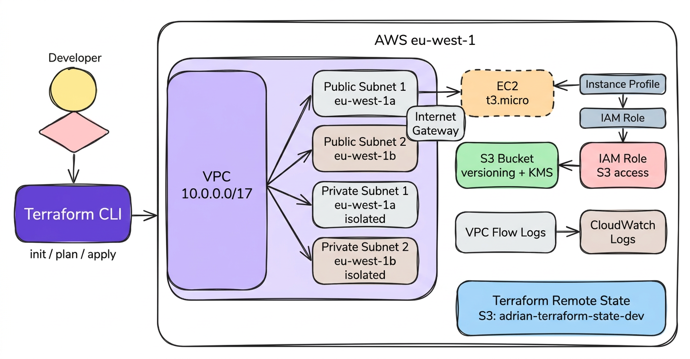

# aws-core-terraform

Modular AWS infrastructure built with Terraform.

The project replaces repetitive AWS Console configuration with a consistent Infrastructure as Code workflow. Infrastructure is defined in code, reviewed with Terraform and deployed with a small number of commands.

The environment covers networking, compute, storage, IAM and monitoring.

---

## Scenario

When I started working with AWS, I found myself spending too much time navigating through different menus and services just to configure a few resources.

I wanted a more consistent and repeatable workflow.

Instead of configuring infrastructure manually through the AWS Console, this project defines the environment as code and deploys it from a single Terraform environment.

---

## Architecture

The infrastructure is deployed in `eu-west-1`.

It includes:

- VPC `10.0.0.0/17`
- 2 public subnets across 2 Availability Zones
- 2 isolated private subnets
- EC2 `t3.micro`
- IAM Role and Instance Profile
- S3 bucket with versioning and KMS encryption
- VPC Flow Logs with CloudWatch Logs
- S3 remote Terraform state

---

## Infrastructure

### VPC

The VPC module provides the network foundation:

- 2 public subnets
- 2 private subnets
- Internet Gateway
- Public route table
- VPC Flow Logs
- CloudWatch Log Group

The private subnets are isolated and currently have no NAT Gateway.

### EC2

The EC2 module deploys an Amazon Linux 2023 `t3.micro` instance.

It uses:

- Encrypted root volume
- IMDSv2
- Automatic AMI selection
- Project and environment tagging

### S3

The S3 module creates a versioned and encrypted bucket.

It includes:

- Versioning
- AWS KMS encryption
- Public access blocking
- Access logging

### IAM

The IAM module creates an EC2 Instance Profile and IAM Role.

The role provides the EC2 instance with the S3 permissions required by the project:

- `s3:GetObject`
- `s3:ListBucket`

---

## Security

Security controls are implemented directly in Terraform.

- IMDSv2 required on EC2
- EC2 root volume encryption
- S3 versioning
- S3 KMS encryption
- S3 public access fully blocked
- VPC Flow Logs enabled
- IAM Role instead of static AWS credentials
- Limited S3 permissions for EC2

The Terraform configuration is also scanned with `tfsec` through GitHub Actions.

---

## Project Structure

The project separates reusable Terraform modules from environment configuration.

| Directory | Purpose |
|-----------|---------|
| `terraform/modules/` | Reusable VPC, EC2, S3 and IAM modules |
| `terraform/envs/dev/` | Development environment configuration |
| `scripts/boto3/` | Python scripts for AWS operations |
| `decisions/` | Architecture Decision Records |
| `docs/` | Documentation and architecture diagram |
| `.github/workflows/` | GitHub Actions CI |

---

## Remote State

Terraform state is stored remotely in Amazon S3.

| Setting | Value |
|---------|-------|
| Bucket | `adrian-terraform-state-dev` |
| Key | `dev/terraform.tfstate` |
| Region | `eu-west-1` |

The backend uses S3 with encryption enabled.

---

## boto3

The project includes a small Python script using boto3 to interact with the deployed infrastructure.

| Function | Purpose |
|----------|---------|
| `lista_ec2()` | Lists EC2 instances and their state |
| `describir_s3()` | Lists S3 buckets |
| `subir_objeto()` | Uploads a test object to S3 |

Run it with `python3 scripts/boto3/aws_ops.py`.

---

## CI

GitHub Actions runs on every push to `main`.

The pipeline performs:

`Terraform Init` → `Terraform Validate` → `tfsec Security Scan`

The current Terraform configuration passes the `tfsec` scan with zero findings.

---

## Deployment

From the development environment:

1. `terraform init`
2. `terraform plan`
3. `terraform apply`

Terraform Plan is used to review infrastructure changes before deployment.

---

## Cleanup

The infrastructure uses real AWS resources, so it should be destroyed after testing.

Run `terraform destroy` from `terraform/envs/dev`.

---

## Design Decisions

The project includes an Architecture Decision Record explaining the choice of Terraform over AWS CDK and CloudFormation.

[ADR-001: Why Terraform over AWS CDK / CloudFormation](decisions/ADR-001-why-terraform.md)

Key reasons:

- Cloud agnostic
- Declarative infrastructure
- Terraform Registry
- Industry adoption
- Remote state support

---

## What I Learned

This project helped me move from manually configuring AWS resources through the Console to managing infrastructure through code.

Key areas:

- Terraform modules
- AWS networking
- EC2
- IAM
- S3
- Remote state
- CloudWatch
- Python and boto3
- GitHub Actions
- Terraform security scanning
- Infrastructure documentation

---

## Project Context

This project is part of a broader infrastructure and homelab learning environment.

The infrastructure was deployed, tested and destroyed in a real AWS account.

The goal was to practice a repeatable Infrastructure as Code workflow with modular Terraform, remote state, security controls, CI and documentation.

---

## Author

Adrian Tamargo

[GitHub](https://github.com/AdrianStudio) · [LinkedIn](https://linkedin.com/in/adrian-daniel-tamargo-miller-35a017355)
